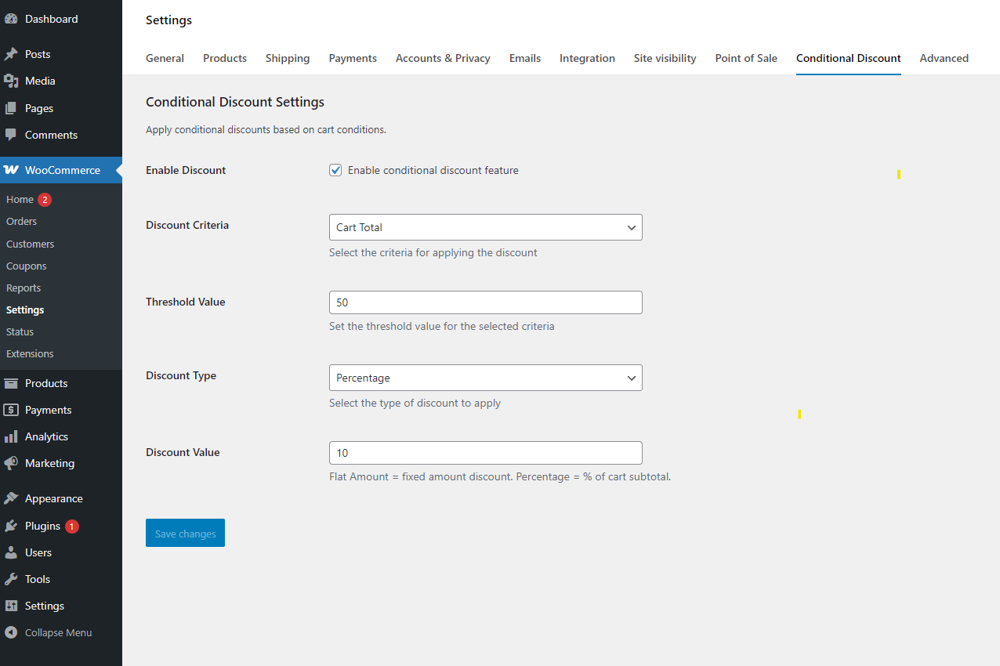

# Conditional Discount for WooCommerce

**Conditional Discount for WooCommerce** is a lightweight and modular WordPress plugin that allows store owners to apply smart, rule-based discounts to WooCommerce products during cart and checkout.  
You can create unlimited discount rules based on product conditions, cart totals, user details, and more.

This plugin is fully OOP-based, uses a namespace-driven architecture, follows the Singleton pattern, and includes an autoloader for clean, scalable development.



---

## Features

- Apply **conditional cart discounts**  
- Create unlimited discount rules  
- Lightweight, clean, and modular code structure  
- Uses **namespaces + autoloader**  
- Follows the **Singleton design pattern**  
- WooCommerce-friendly architecture  
- Easy to extend with custom conditions  
- No unnecessary scripts or assets loaded on the frontend

---

## Plugin Architecture

Your plugin is built using:

### **1. Namespaces**
Improves readability and prevents function/class conflicts.

Namespaces used:
```
Shanto\ConditionalDiscount
Shanto\ConditionalDiscount\App
Shanto\ConditionalDiscount\App\Traits
Shanto\ConditionalDiscount\App\Modules
```

---

### **2. Autoloader**
Loads all classes automatically based on folder structure:

```
inc/
  App/
    Traits/
    Modules/
```

No manual includes required.

---

### **3. Singleton Pattern**
Every major class uses a `Singleton` trait:

```php
trait Singleton {
    private static $instance = null;

    public static function instance(){
        if (! self::$instance){
            self::$instance = new self();
        }
        return self::$instance;
    }
}
```

Ensures only one instance of each module runs.

---

### **4. Modular Design**
Each core functionality lives inside `Modules/`:

```
Modules/
  - Discounts.php        # Main discount handling logic
  - CartConditions.php   # Handles cart condition rules
```

The plugin automatically loads each module.

---

## 🛠 How It Works

### ✔ Step 1 — Plugin bootstraps via main file  
The main plugin file defines:

- Plugin name  
- Version  
- Autoloader  
- Core initializer class  

Example:

```php
require_once __DIR__ . '/inc/Autoloader.php';
Autoloader::register();
Plugin::instance();
```

---

### ✔ Step 2 — Modules hook into WooCommerce

Example from `Discounts.php`:

```php
add_action('woocommerce_cart_calculate_fees', [$this, 'apply_discounts']);
```

This allows your plugin to:

- Check cart conditions  
- Calculate discount amount  
- Apply WooCommerce fee as a negative value  

---

### ✔ Step 3 — Conditions decide if discount is applied  
Example from `CartConditions.php`:

```php
public function is_valid(){
    return WC()->cart && WC()->cart->subtotal > 100;
}
```

You can add more conditions anytime.

---

## Installation

1. Download the plugin or clone the repository:
   ```bash
   git clone https://github.com/shanto-w3dev/Conditional-Discount-for-WooCommerce.git
   ```

2. Place the folder inside:
   ```
   wp-content/plugins/
   ```

3. Activate **Conditional Discount for WooCommerce** from the WordPress Plugins screen.

---

## Example Usage

The plugin automatically applies:

- A cart discount if cart subtotal exceeds a specific condition  
- Discounts through WooCommerce's fee API  

To extend conditions, create a new file inside:

```
inc/App/Modules/
```

Then register it in the plugin initializer.

---

## Hooks Used

### **WooCommerce Hooks**
| Hook | Purpose |
|------|---------|
| `woocommerce_cart_calculate_fees` | Applies discount dynamically |

### **WordPress Hooks**
| Hook | Purpose |
|------|---------|
| `plugins_loaded` | Initializes plugin |

---

## License

This plugin is open-source and licensed under the **GPL v2 License**.

---

## Contributing

Pull requests are welcome!  
If you find bugs or want new features, feel free to open an issue in the repo.

---

## Author

**Riadujjaman Shanto**  
WordPress Developer  
GitHub: https://github.com/shanto-w3dev
